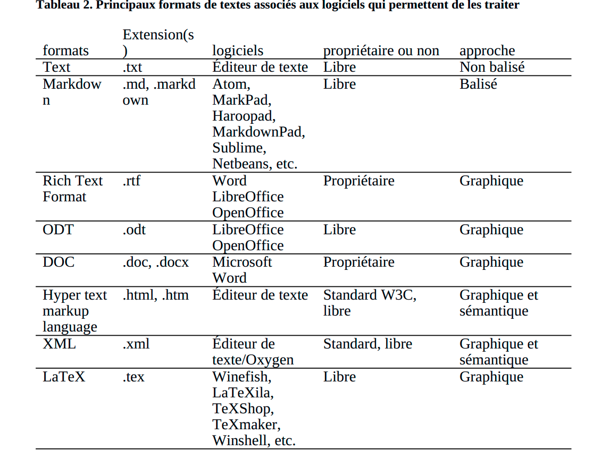

= II / La production des contenus

= La plate-forme et l’écriture
== Les techniques et la pensée

[.lead]
Les outils façonnent la pensée. Ce que nous pouvons penser et ce que nous pouvons dire résulte d’une dynamique dans laquelle les outils et les techniques jouent un rôle fondamental. L’idée spiritualiste selon laquelle la pensée se construit au-delà de toute matérialité et que les outils et les techniques ne servent qu’à la faire apparaître a été profondément critiquée, en particulier au XXe siècle : pensons par exemple à la célèbre phrase de McLuhan « le médium est le message » ou aux analyses de Jack Goody [1979] sur le rapport étroit entre l’écriture et la naissance de la pensée scientifique [Deseilligny, 2013].

Ce qui nous intéresse plus particulièrement ici est le fait que les outils et les techniques d’écriture ne sont pas neutres par rapport aux contenus que l’on peut produire. Pour être plus précis : les techniques et les outils d’écriture, mais aussi les modes de diffusion des textes, conditionnent et façonnent ce que l’on écrit.

Du côté des modes de diffusion, on peut ainsi souligner la différence fondamentale entre la forme orale et la forme écrite. Comme le remarque Christian Vandendorpe, les contenus transmis dans les traditions orales sont caractérisés par un aspect formulaire – c’est-à-dire ponctué de formules récurrentes telles que l’on peut en observer dans les poèmes homériques, par exemple – qui limite de fait l’éventail des potentialités des récits, lesquels ont tendance à se standardiser. « Les cultures orales ne s’expriment pas seulement en formules, elles pensent en formules » [Ong, 1977 cité par Vandendorpe, 1999, p. 26]. L’écriture permet l’émergence de contenus à l’organisation plus complexe, ainsi que leur conservation et leur consultation. Pour autant, le papyrus – support linéaire qui ne peut être consulté que dans un ordre prédéfini – n’offre pas encore les possibilités du codex, support divisé en pages, plus maniable, qui permet de passer facilement d’un point du texte à un autre. Cette distinction a des conséquences majeures : aurait-on pu penser une encyclopédie sur papyrus ? Le concept d’encyclopédie serait-il apparu sans l’invention du codex ?

Quant aux techniques et aux outils à proprement parler, on connaît déjà l’influence des instruments sur le statut de l’écriture : de la plume – réservée à une élite – à la démocratisation du stylo à bille, un changement radical de la valeur symbolique de l’écriture s’est opéré. Entre l’imagerie de l’auteur à sa table de travail, plume à la main, et l’omniprésence industrielle du stylo à bille qui, comme l’affirme Umberto Eco, est probablement le « seul exemple de socialisme réalisé », on s’aperçoit qu’écrire n’a plus le même sens. Mais outre la dimension symbolique, il est évident que la vitesse de l’écriture, tout comme la valeur économique du papier et son format, ou encore les possibilités d’effacer ce qui a été écrit, changent non seulement les pratiques d’écriture, mais aussi le contenu même de ce que l’on peut écrire.

= Les outils numériques

Les outils d’écriture et de diffusion n’ont cessé d’évoluer dans l’histoire de nos sociétés. Les changements survenus à la fin du XXe siècle et au début du XXIe sont cependant particulièrement impressionnants. On peut résumer ces changements en cinq grandes catégories : 1) la maniabilité du texte ; 2) le rapprochement entre texte manuscrit et texte diffusé ; 3) la multiplication des formats ; 4) les possibilités de structuration ; 5) les possibilités de recherche de ressources pour l’écriture.

Tout d’abord (point 1), l’introduction des logiciels de traitement de texte, dont la diffusion a été généralisée à partir des années 1980 [Kirschenbaum, 2016], a profondément changé les possibilités de manipulation du texte. À la différence de l’écriture au stylo ou à la machine à écrire, le texte numérique peut être facilement effacé, copié, collé, restructuré. Cela implique notamment (point 2) le brouillage de la frontière entre le brouillon et la version définitive du texte, ainsi que la disparition progressive de figures professionnelles comme le dactylographe. Entre l’écriture et la diffusion des contenus, le processus éditorial compte ainsi une médiation en moins. La forme même du texte – à partir des logiciels WYSIWYG (accronyme de l’anglais « what you see is what you get », « ce que vous voyez est ce que vous obtenez » parfois traduit par « tel-tel » en français) – se rapproche sensiblement de la forme finale du texte imprimé. Ces deux premiers changements œuvrent en faveur d’une plus forte accessibilité à la publication pour tous. Ils nourrissent par ailleurs un sentiment de marginalisation des processus de médiation entre le manuscrit et le texte publié.

Mais il ne faut pas faire l’erreur de considérer les outils numériques comme un tout homogène (point 3) : s’il est vrai que certains logiciels de traitement de texte – et en particulier Microsoft Word – se sont imposés dans les pratiques, il est aussi vrai que les logiciels et les formats n’ont cessé de se diversifier. Il est important de souligner que chaque format et chaque logiciel porte une idée particulière de ce que signifie « écrire » et « publier ». Les différents types de visualisation du texte influent sur la perception de l’acte d’écrire, mais surtout, la structuration même du matériel écrit change selon les formats. En particulier, il y a une différence fondamentale entre les formats orientés vers la mise en forme graphique du texte et ceux orientés vers la structuration sémantique (point 4). Les premiers requièrent un balisage des attributs graphiques du texte – choix de la police et de la taille du caractère, usage de l’italique ou du gras, disposition du texte sur la page, etc. Typiquement, Word – et tous les autres logiciels WYSYWYG – est fondé sur ce principe. Les formats RTF (Rich text format) et doc (ou docx) sont représentatifs de cette approche. Le sens du texte est exprimé à travers sa mise en forme graphique. Ce type d’approche tend à considérer le texte numérique lors de sa production comme une étape avant l’impression.

Un autre approche consiste à baliser le texte selon sa valeur sémantique : c’est le cas des outils basés sur les technologies XML (Extendible markup language), où l’on indique par exemple qu’une partie du texte est un titre de niveau 1 ou 2, une note, ou, de manière plus précise, qu’un mot est le nom d’une ville ou d’une personne, etc. Les formats sémantiques ont la caractéristique de permettre une forte structuration logique du texte, ce qui était impossible sur papier. En ce sens, ces formats représentent un changement important par rapport au modèle de l’imprimé. Lors de l’écriture, il devient important de baliser ce que l’on écrit par rapport à son sens, afin d’être ensuite capable de manipuler automatiquement le texte.

Pour finir, écrire en environnement numérique signifie – au moins depuis les années 1990 – avoir accès, sur le même support qu’on utilise pour écrire (ordinateur, tablette…), à un grand nombre de sources potentiellement mobilisables (point 5) : le Web propose en effet une quantité impressionnante de contenus qui peuvent servir de documentation. Tous les types d’écriture sont concernés : de la littérature – pensons aux accusations de plagiat de Wikipédia adressées à Michel Houellebecq pour son roman La Carte et le Territoire – aux textes scientifiques – lors de l’écriture desquels le chercheur dispose d’un accès numérique à un grand nombre de sources.

Une réflexion s’impose quant à la façon dont le numérique modifie la phase de production des contenus éditoriaux, et aux enjeux intellectuels et politiques qui en découlent. Nous n’avons pas fait qu’inventer des outils permettant de réaliser plus rapidement et plus efficacement des tâches déjà connues : nous faisons désormais face à un environnement d’écriture qui bouleverse profondément ce que signifie écrire.

Parallèlement, il faut insister sur le fait que les outils numériques ne peuvent pas être considérés comme un tout. Il ne s’agit donc pas de chercher comment « le numérique » en général change notre façon de produire des contenus, mais plutôt de réfléchir aux différentes formes d’écriture que les outils numériques proposent, pour comprendre comment les choix technologiques reflètent nos conceptions de l’écriture. En d’autres termes, si l’on ne saurait dire ce que fait exactement le numérique à l’écriture – et en général à la pensée – il faut du moins analyser les visions du monde et de l’écriture au fondement de chaque outil.

Tableau 2

